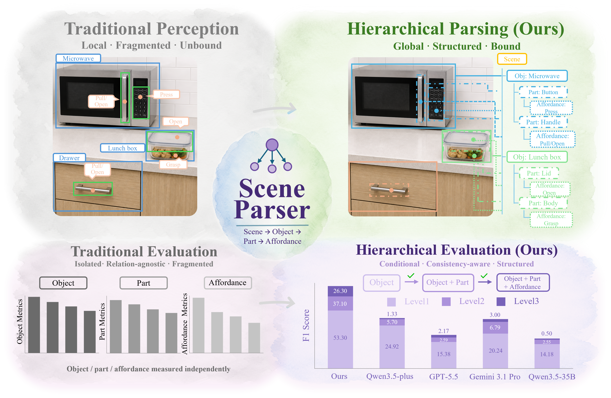

# <p align="center"><b>SceneParser: Hierarchical Scene Parsing for Visual Semantics Understanding</b></p>

<p align="center">
  <a href="https://github.com/ZGCA-HMI-Lab/SceneParser"></a>
  <a href="https://arxiv.org/abs/2605.14923"></a>
  <a href="https://huggingface.co/SceneParser/SceneParser-model"></a>
  <a href="https://huggingface.co/datasets/SceneParser/SceneParser-bench"></a>
</p>

<p align="center">
  <b>Pengxin Xu</b><sup>1,2</sup> · <b>Xincheng Lin</b><sup>3</sup> · <b>Luping Xiao</b><sup>2,4</sup> · <b>Qing Jiang</b><sup>5</sup> · <b>Meishan Zhang</b><sup>1</sup> · <b>Hao Fei</b><sup>6,†</sup> · <b>Shanghang Zhang</b><sup>7</sup> · <b>Xingyu Chen</b><sup>2,†</sup>
</p>

<p align="center">
  <sup>1</sup>HIT (Shenzhen), <sup>2</sup>ZGCA, <sup>3</sup>HUST, <sup>4</sup>BUPT, <sup>5</sup>SCUT, <sup>6</sup>Oxford, <sup>7</sup>PKU
</p>

<p align="center">
  <sup>†</sup>Corresponding author
</p>

## 📖 Abstract

SceneParser is a VLM-based hierarchical parser for physical scene understanding.
Given an RGB image and an object- or scene-level query, it generates a structured
JSON hierarchy that binds objects, parts, and affordance points into explicit
`scene -> object -> part -> affordance` chains. This repository provides the
training, evaluation, data conversion, and released checkpoint workflow needed to
reproduce SceneParser on SceneParser-Bench.

<p align="center">
  
</p>

## ⚙️ Installation

```bash
conda create -n sceneparser python=3.10 -y
conda activate sceneparser
pip install torch==2.7.0 torchvision --index-url https://download.pytorch.org/whl/cu128
pip install -r requirements.txt
pip install -v -e .
```

## 📦 Data Preparation

Download the SceneParser JSONL annotations from the released SceneParser-Bench
HuggingFace dataset and place them under `datasets`:

```bash
mkdir -p datasets
# Download train.jsonl and val.jsonl from the SceneParser-Bench dataset release.
```

The JSONL annotations use relative image paths:

```text
datasets/EgoObjects/images/<image_name>.jpg
```

Download the EgoObjects images from the official release:

```text
https://github.com/facebookresearch/EgoObjects
https://ai.meta.com/datasets/egoobjects-downloads/
```

Download both image archives:

```text
EgoObjectsV1_images.zip
images.zip
```

Place the extracted images under `datasets/EgoObjects/images`:

```bash
mkdir -p datasets/EgoObjects
unzip EgoObjectsV1_images.zip -d datasets/EgoObjects
unzip images.zip -d datasets/EgoObjects
```

After extraction, make sure this path exists:

```text
datasets/EgoObjects/images/<image_name>.jpg
```

If the archives are extracted into a different folder layout, move or symlink
the combined image folder to `datasets/EgoObjects/images`.

## 🔁 Convert JSONL To TSV

Training reads TSV files. Convert `datasets/train.jsonl` with:

```bash
python3 datasets/tools/convert__to_tsv_mp.py \
  --json_file datasets/train.jsonl \
  --save_image_tsv_path datasets/train_tsv/images.tsv \
  --save_ann_tsv_path datasets/train_tsv/annotations.tsv \
  --save_ann_lineidx_path datasets/train_tsv/annotations.tsv.lineidx \
  --num_workers 32
```

Optional sanity check:

```bash
wc -l datasets/train.jsonl datasets/train_tsv/annotations.tsv.lineidx
```

## 🏗️ Training

The training pipeline uses a three-stage curriculum. By default, scripts read
training TSV files from `datasets/train_tsv` and write checkpoints to
`finetuning/work_dirs`.

Stage 1 trains from the base model using no-pseudo supervision:

```bash
MODEL_NAME_OR_PATH=IDEA-Research/SceneParser \
bash finetuning/scripts/sft_sceneparser_curriculum_stage1_nopseudo_when_available.sh
```

Stage 2 continues from Stage 1 and mixes 70% no-pseudo with 30% pseudo-completed
samples:

```bash
bash finetuning/scripts/sft_sceneparser_curriculum_stage2_mixed70pseudo30_when_available.sh
```

Stage 3 continues from Stage 2 and mixes 50% no-pseudo with 50% pseudo-completed
samples:

```bash
bash finetuning/scripts/sft_sceneparser_curriculum_stage3_mixed50pseudo50_when_available.sh
```

Useful overrides:

```bash
GPUS_PER_NODE=8
NNODES=1
SCENEPARSER_TSV_DIR=/path/to/train_tsv
OUTPUT_DIR=work_dirs/my_run
```

## 📊 Evaluation

The evaluation flow has two steps:

1. Run inference with a trained checkpoint to generate `answer.jsonl`.
2. Run hierarchical metrics and export the four final report metrics.

Download the released SceneParser model checkpoint and use it as `MODEL_PATH`:

```bash
MODEL_PATH=/path/to/SceneParser-model \
TEST_JSONL=datasets/val.jsonl \
OUTPUT_DIR=evaluation/results/curriculum_stage3_eval \
NUM_SHARDS=8 \
bash evaluation/scripts/eval_sceneparser_obj_sharded.sh
```

The script writes:

```text
evaluation/results/curriculum_stage3_eval/answer.jsonl
evaluation/results/curriculum_stage3_eval/eval_results_filtered.json
evaluation/results/curriculum_stage3_eval/final_metrics.json
```

`final_metrics.json` contains only the four public metrics:

```text
L1        object-level hierarchy score
L2        object-part hierarchy score
L3        object-part-affordance hierarchy score
ParseRate hierarchical completeness
```

## 📜 License

This code release is licensed under [IDEA License 1.0](LICENSE) for non-commercial research use; it builds on Rex-Omni and Qwen, so please comply with all upstream licenses.

## 🙏 Acknowledgement

This repository builds on [Rex-Omni](https://github.com/IDEA-Research/Rex-Omni). We thank the authors for their excellent open-source work.

## 📖 Citation

```bibtex
@article{sceneparser2026,
  title   = {SceneParser: Hierarchical Scene Parsing for Visual Semantics Understanding},
  author  = {Pengxin Xu and Xincheng Lin and Luping Xiao and Qing Jiang and Meishan Zhang and Hao Fei and Shanghang Zhang and Xingyu Chen},
  journal = {arXiv preprint arXiv:2605.14923},
  year    = {2026}
}
```
